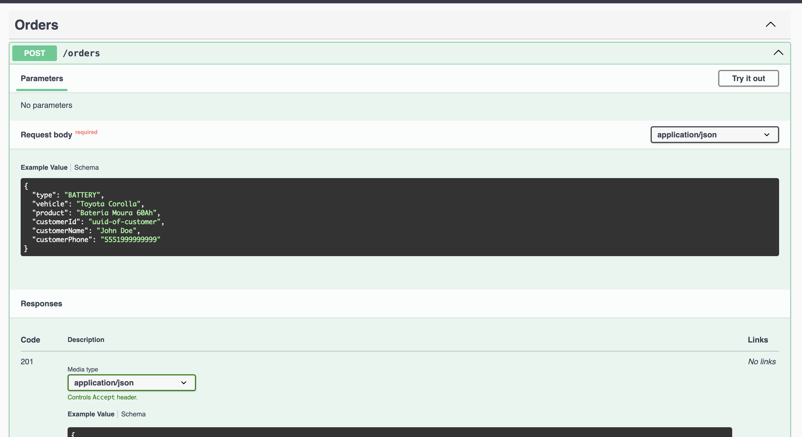

# CRM API

> Developed using **Antigravity**, with image generation integrated directly in the IDE with **Nano Banana**.

Simple CRM for customer and order management, featuring automated message sending.

## Documentation

- [Swagger UI](http://localhost:3000/api) - Interactive API documentation.

<div align="center">
  
</div>

> **Note**: The API documentation is not hosted publicly. You must run the project locally to access the interactive Swagger UI to analyze the endpoints.

## Features & Skills Showcase

This API was built with a focus on **scalability**, **maintainability**, and **best practices**.

- **Modular Architecture**: Organized by feature (Customer, Order, Message) to ensure separation of concerns.
- **Dependency Injection**: Heavy use of NestJS DI container for cleaner testing and loose coupling.
- **Robust Validation**: `class-validator` and `class-transformer` (DTOs) ensure data integrity at the entry point.
- **Global Error Handling**: Custom Exception Filters and Interceptors allow for consistent API responses.
- **Database Management**: Prisma ORM with PostgreSQL for type-safe database interactions.
- **Containerization**: Fully Dockerized (App + Database) for consistent local development and easy deployment.
- **Automated Messaging**: Scheduled tasks using `check-orders-task.service` to automate customer interactions.

## Technical Stack

- **Framework**: [NestJS](https://nestjs.com/) (Node.js)
- **Language**: TypeScript
- **Database**: PostgreSQL
- **ORM**: Prisma
- **Documentation**: Swagger (OpenAPI)
- **Testing**: Jest (Unit & E2E)
- **Containerization**: Docker & Docker Compose
- **Authentication**: JWT & Passport
- **Architecture**: REST API

## Testing & Coverage

The application is rigorously tested to ensure reliability.

- **Unit Tests**: Covering Services and Controllers.
- **E2E Tests**: Validating full API flows.
- **Coverage**: ~45.29% (Testing Services & Controllers).

Run tests with:

```bash
npm run test       # Unit tests
npm run test:e2e   # End-to-End tests
npm run test:cov   # Coverage report
```

## Message Handling

The API is responsible for providing clear feedback on operation results.

### Success

In case of success, the API returns an object containing:

- `success`: `true`
- `code`: HTTP Code (e.g., 200, 201)
- `data`: Response data (if any)
- `message`: Descriptive message (e.g., "Order created successfully")

### Error

In case of error, the API returns an object containing:

- `success`: `false`
- `code`: HTTP Error Code (e.g., 400, 404, 409)
- `message`: Descriptive error message (e.g., "This phone number is already linked to another customer.")
- `invalidFields`: List of invalid fields (in case of validation error)
