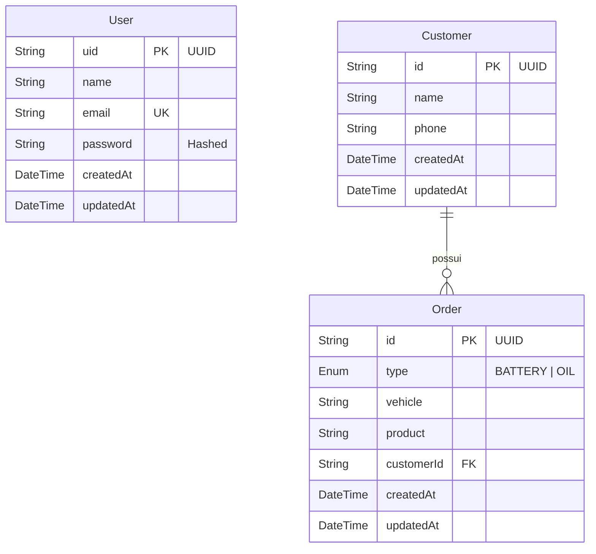

# Documentação do Banco de Dados

O projeto utiliza **PostgreSQL** como banco de dados relacional e **Prisma ORM** para modelagem e acesso aos dados.

## Diagrama de Entidade-Relacionamento (ER)

## Tabelas (Models)

### 1. User

Representa os usuários do sistema (funcionários/administradores) que podem fazer login.

- **uid**: Identificador único (UUID).
- **email**: Deve ser único no sistema.
- **password**: Armazenada como hash (bcrypt).

### 2. Customer

Representa os clientes finais da loja.

- **id**: Identificador único (UUID).
- **orders**: Relacionamento 1:N com pedidos (um cliente pode ter vários pedidos).

### 3. Order

Representa um serviço ou venda realizado.

- **type**: Enum (`BATTERY` ou `OIL`).
- **customerId**: Chave estrangeira ligando ao Cliente.
- **vehicle**: Descrição livre do veículo.
- **product**: Descrição livre do produto vendido.

## Comandos Úteis (Prisma)

- **Criar Migração**: `npx prisma migrate dev --name nome-da-mudanca`
- **Visualizar Dados (GUI)**: `npx prisma studio`
- **Gerar Cliente**: `npx prisma generate`
